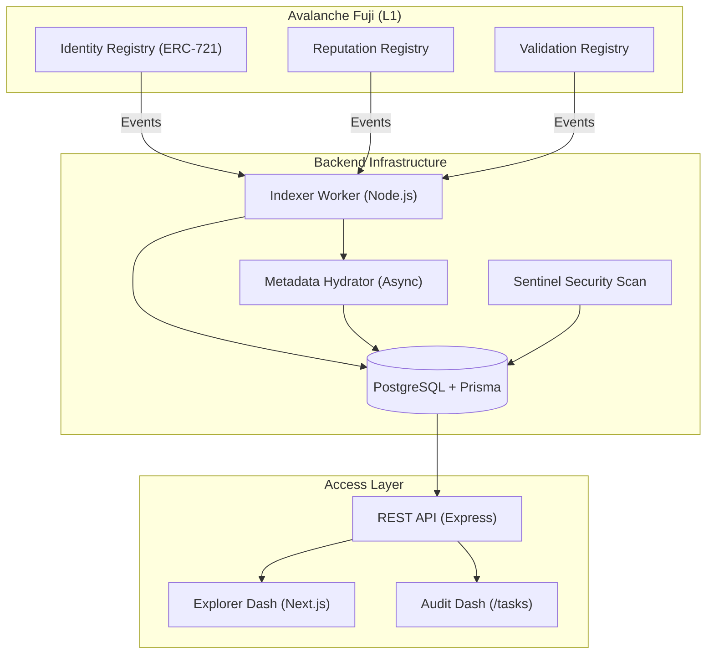
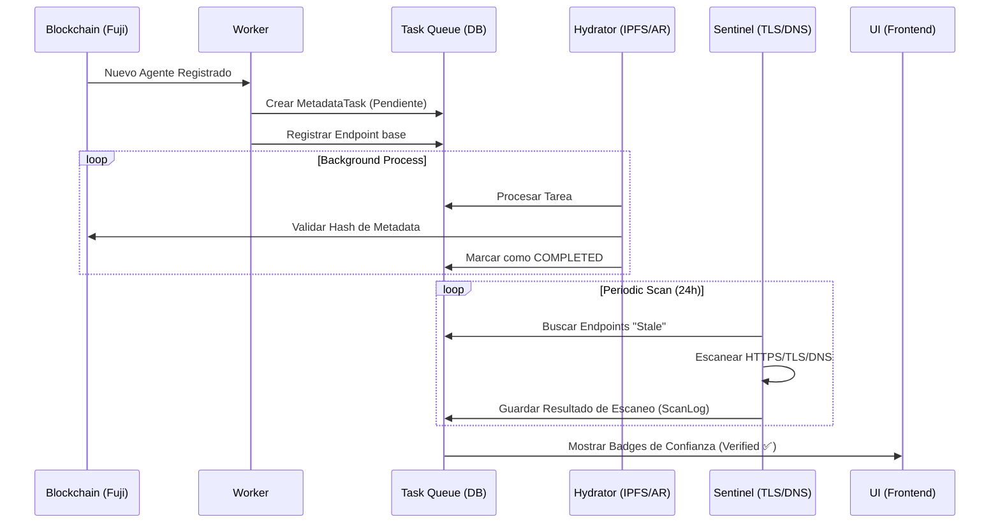

# 🌌 Shadow-Galaxy: Reporte Visual del Ecosistema

Este reporte detalla la arquitectura "Hardened" y el flujo de confianza del Scanner ERC-8004.

## 🏗️ Arquitectura del Sistema
El sistema está diseñado en una estructura de monorepo escalable, separando la lógica de indexación de la de consumo.

## 🔄 Flujo de Confianza (Sentinel & Hydration)
Cómo un agente pasa de ser "visto" en la blockchain a ser un "Agente de Confianza".

## 📊 Componentes del Dashboard

### 1. Agent Explorer (Home)
*   **Trust Badges**: Visualización inmediata de la salud del agente.
*   **Filter System**: Filtrado por categoría, activo y soporte x402.

### 2. Audit Dashboard (`/tasks`)
*   **Estado en Tiempo Real**: Monitor de las tareas de hidratación de fondo.
*   **Control de Errores**: Visualización de fallos de IPFS o red con lógica de reintentos.

| Componente | Nivel de Seguridad | Estado |
| :--- | :--- | :--- |
| **Blockchain Sync** | 🛡️🛡️🛡️ (Máximo) | Operativo (Persistente) |
| **Metadata Resolution** | 🛡️🛡️ (Alto) | Operativo (Asíncrono) |
| **Sentinel Guard** | 🛡️🛡️🛡️ (Máximo) | Operativo (Auto-auditoría) |

---
> [!TIP]
> **Vista Técnica**: Puedes consultar el código fuente y las ABIs en el paquete `@scanner/erc8004-sdk` para integraciones personalizadas.
